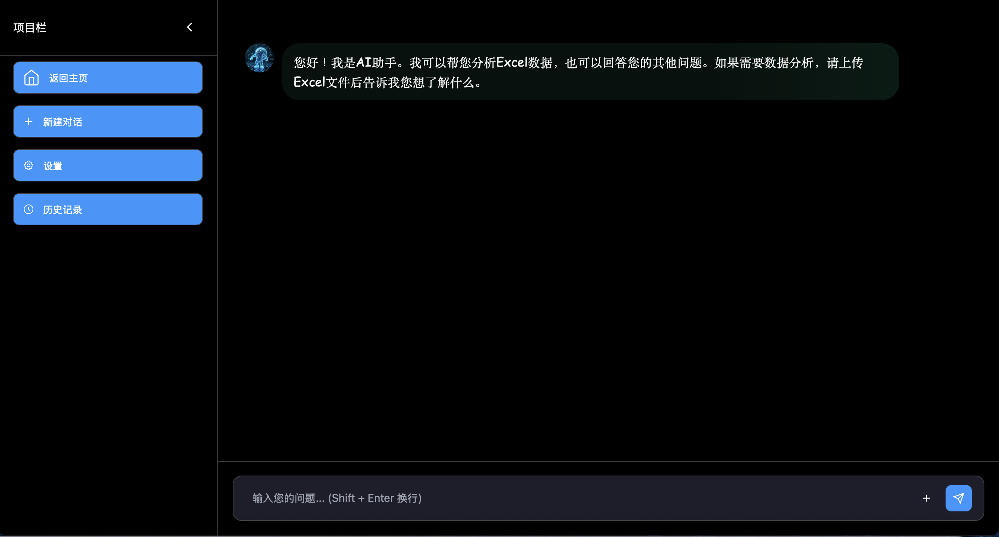
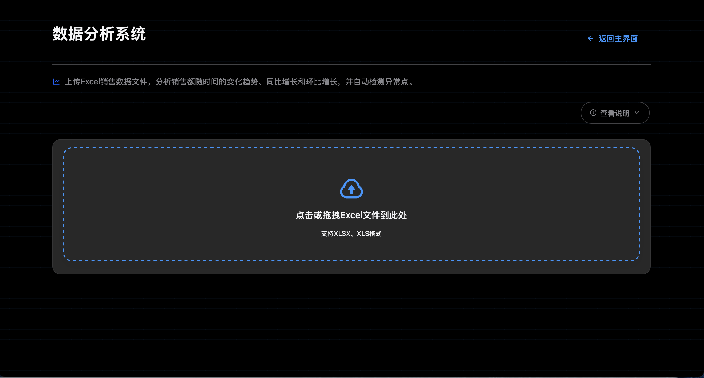

# 🚀 智能数据分析系统

[](https://www.python.org/downloads/)
[](https://flask.palletsprojects.com/)
[](LICENSE)
[](https://github.com/jom111-111/data-analysis-system)

> 🎯 一个功能强大的Web数据分析平台，集成多文件比较、AI智能分析、销售趋势预测等功能，为企业数据决策提供全方位支持。
> 
> ✨ **现代化界面** | 🎨 **粒子动画** | 🌓 **深色主题** | 📱 **响应式设计**

## ✨ 核心特性

### 📊 多维数据分析
- **📈 多文件比较** - 支持Excel文件批量对比分析
- **🔍 单文件分析** - 深度挖掘单一数据源价值
- **🤖 AI智能分析** - 基于机器学习的数据洞察
- **📉 销售趋势分析** - 时间序列分析与预测

### 🎨 现代化界面
- **🌓 多主题支持** - 深色/浅色主题，7种精美配色
- **📱 响应式设计** - 完美适配桌面端和移动端
- **✨ 粒子动画** - 可自定义的动态背景效果
- **🎯 交互体验** - 流畅的动画和反馈效果

### 🔐 企业级安全
- **👤 用户管理系统** - 注册、登录、权限控制
- **📧 邮箱验证** - 安全的用户验证机制
- **🛡️ 数据保护** - 多层安全防护体系
- **📝 操作日志** - 完整的用户行为记录

### 📈 数据可视化
- **📊 交互式图表** - 基于Plotly的动态图表
- **📋 数据仪表盘** - 关键指标实时监控
- **📄 报告导出** - 支持Excel、PDF格式导出
- **🔔 智能通知** - 实时消息推送系统

## 🚀 快速开始

### 方式一：一键启动（推荐）
```bash
# 克隆项目
git clone https://github.com/yourusername/data-analysis-system.git
cd data-analysis-system

# 一键启动（macOS）
chmod +x start.command
./start.command
```

### 方式二：手动部署
```bash
# 创建虚拟环境
python -m venv venv
source venv/bin/activate  # Windows: venv\Scripts\activate

# 安装依赖
pip install -r requirements.txt

# 启动应用
python app.py
```

🌐 访问 `http://localhost:5000` 开始使用！

## 📸 界面预览

### 🏠 主界面
<div align="center">
  
  <br/>
  <sub><b>🎨 现代化深色主题 | ✨ 粒子动画背景 | 🎯 四大核心功能模块</b></sub>
</div>

### 🤖 AI智能分析
<div align="center">
  
  <br/>
  <sub><b>💬 智能对话界面 | 🧠 AI数据助手 | 📊 Excel数据分析专家</b></sub>
</div>

### 📈 销售趋势分析
<div align="center">
  
  <br/>
  <sub><b>📊 时间序列分析 | 📈 趋势预测 | 🔍 异常点检测 | 📁 拖拽上传</b></sub>
</div>

---

> 🎨 **核心功能**
> 
> - 📊 **多文件比较** - 支持Excel文件批量对比分析
> - 🔍 **单文件分析** - 深度挖掘单一数据源价值
> - 🤖 **AI智能分析** - 基于GPT的智能对话式数据分析
> - 📈 **销售趋势分析** - 时间序列分析、趋势预测、异常检测
>
> 🌟 **界面亮点**：
> - 💬 **AI对话界面** - 自然语言交互，智能数据问答
> - 🎯 **现代化设计** - 卡片式布局，直观易用
> - ✨ **粒子动画** - 动态背景效果，可自定义颜色
> - 🌓 **深色主题** - 专业视觉体验，保护用户视力
> - 📱 **响应式布局** - 完美适配桌面端和移动端

## 🛠️ 技术栈

### 后端技术
- **🐍 Python 3.8+** - 核心开发语言
- **🌶️ Flask** - 轻量级Web框架
- **🗄️ SQLite** - 嵌入式数据库
- **📊 Pandas** - 数据处理与分析
- **🤖 OpenAI API** - AI智能分析

### 前端技术
- **🎨 HTML5/CSS3** - 现代Web标准
- **⚡ JavaScript ES6+** - 交互逻辑实现
- **🎯 Tailwind CSS** - 原子化CSS框架
- **📈 Plotly.js** - 数据可视化图表
- **✨ Particles.js** - 粒子动画效果

## 📋 功能详解

### 🔍 数据分析模块
```python
# 支持的分析类型
- 多文件数据对比分析
- 单文件数据分布分析  
- 重复数据检测与清洗
- 数据质量评估报告
- 异常值识别与处理
```

### 🤖 AI智能分析
```python
# AI分析能力
- 自动数据类型识别
- 智能业务洞察生成
- 趋势预测与建议
- 异常检测与告警
- 自然语言查询支持
```

### 📊 销售趋势分析
```python
# 时间序列分析功能
- 📁 拖拽上传Excel销售数据（支持XLSX/XLS格式）
- 📊 多粒度时间聚合（日/周/月/季/年）
- 📈 销售额变化趋势分析
- 📉 同比增长和环比增长计算
- 🔍 自动异常点检测与标记
- 📋 详细的趋势分析报告
- 📱 响应式图表展示
```

## ⚙️ 配置说明

### 环境变量配置
```bash
# .env 文件配置
FLASK_ENV=production
SECRET_KEY=your-secret-key
OPENAI_API_KEY=your-openai-api-key
SMTP_SERVER=smtp.gmail.com
SMTP_PORT=587
SMTP_USERNAME=your-email@gmail.com
SMTP_PASSWORD=your-app-password
```

### 数据库初始化
```bash
# 首次运行会自动创建数据库表
python -c "from app import init_db; init_db()"
```

## 🔧 高级配置

### 自定义主题
```css
/* 在 static/css/main.css 中自定义主题 */
:root {
  --primary-color: #your-color;
  --background-color: #your-bg-color;
  /* 更多变量... */
}
```

### AI模型配置
```python
# 在 ai_analysis.py 中配置AI模型
OPENAI_MODEL = "gpt-4"  # 或 "gpt-3.5-turbo"
MAX_TOKENS = 2000
TEMPERATURE = 0.7
```

## 🤝 贡献指南

我们欢迎所有形式的贡献！请遵循以下步骤：

1. **🍴 Fork** 本仓库
2. **🌿 创建特性分支** (`git checkout -b feature/AmazingFeature`)
3. **💾 提交更改** (`git commit -m 'Add some AmazingFeature'`)
4. **📤 推送分支** (`git push origin feature/AmazingFeature`)
5. **🔄 创建Pull Request**

### 开发规范
- 遵循PEP 8代码规范
- 添加适当的注释和文档
- 确保所有测试通过
- 更新相关文档

## 📝 更新日志

### v2.5.1 (2025-01-01)
- ✨ 新增销售趋势分析模块
- 🎨 优化粒子颜色选择器界面
- 🔧 改进使用记录显示逻辑
- 🐛 修复时间显示格式问题

### v2.4.0 (2024-12-15)
- 🤖 集成AI智能分析功能
- 📊 增强数据可视化效果
- 🔔 新增实时通知系统
- 🌓 支持多主题切换

## 📄 许可证

本项目采用 MIT 许可证 - 查看 [LICENSE](LICENSE) 文件了解详情。

## 🙏 致谢

感谢以下开源项目的支持：
- [Flask](https://flask.palletsprojects.com/) - Web框架
- [Plotly](https://plotly.com/) - 数据可视化
- [Tailwind CSS](https://tailwindcss.com/) - CSS框架
- [Particles.js](https://vincentgarreau.com/particles.js/) - 粒子动画

## 📞 联系方式

- 📧 邮箱：support@dataanalyzer.com
- 🐛 问题反馈：[Issues](https://github.com/yourusername/data-analysis-system/issues)
- 💬 讨论交流：[Discussions](https://github.com/yourusername/data-analysis-system/discussions)

---

<div align="center">

**⭐ 如果这个项目对你有帮助，请给它一个星标！**

Made with ❤️ by [Your Name](https://github.com/yourusername)

</div> 